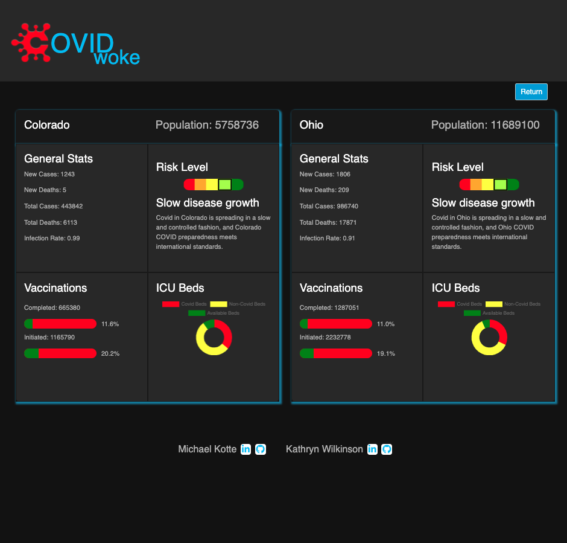

# COVID woke

## Description

COVID woke seeks to elevate the public information environment by presenting necessary information that is accessible and easy to understand. This application uses third party API's which allow the user to view detailed, regularly updated and complete statistics. Providing users the ability to easily asses the current COVID climate between multiple regions. Our goal is to empower and inspire humans to live with elevated integrity, mindfulness, and respect.

## Features

Users are able to search specific states and counties for in-depth information about the current situation of the global pandemic. Color coded graphs and charts make it easy to assess the current risk level of the region they search.

### Visuals

### Links

Personal Version
[DeployedApp](<https://nahco-code.github.io/Covid-Woke-personal-version/>) (GitHub Pages)
[GitHub Repo](<https://github.com/NAHco-code/Covid-Woke-personal-version.git>)

Original
[DeployedApp](<https://mkotte.github.io/COVIDwoke>) (GitHub Pages)
[GitHub Repo](<https://github.com/mkotte/COVIDwoke>)

<!--
### Links

[Live](<https://mkotte.github.io/COVIDwoke>) (GitHub Pages)
[Code](<https://github.com/mkotte/COVIDwoke>)

Summary:
Users are able to search specific states and counties for in-depth information about the current situation of the global pandemic. Color coded graphs and charts make it easy to assess the current risk level of the region they search.

Role:
Team of 2 - 50/50

Tools:
html, css, javascript, bootstrap,
3 apis -

Original Project Requirements:

* Use a CSS framework other than Bootstrap.
* Be deployed to GitHub Pages.
* Be interactive (i.e., accept and respond to user input).
* Use at least two server-side APIs.
* Does not use alerts, confirms, or prompts (use modals).
* Use client-side storage to store persistent data.
* Be responsive.
* Have a polished UI.
* Have a clean repository that meets quality coding standards (file structure, naming conventions, follows best practices for class/id naming conventions, indentation, quality comments, etc.).
* Have a quality README (with unique name, description, technologies used, screenshot, and link to deployed application).
-->
